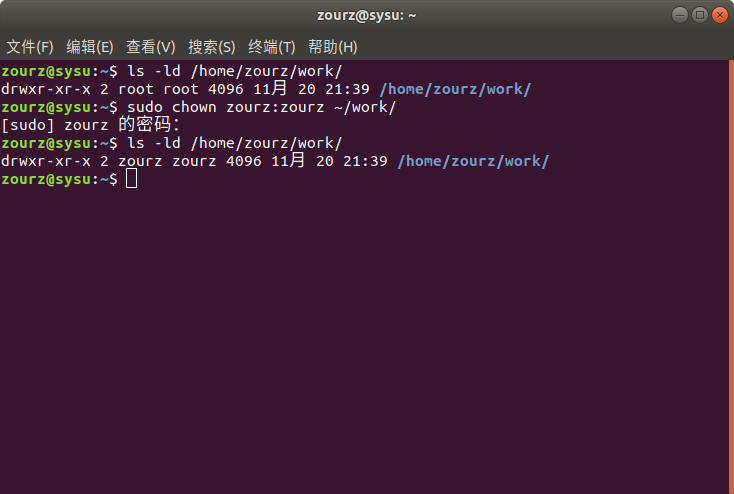
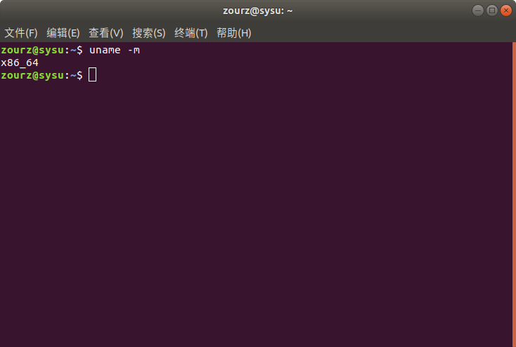
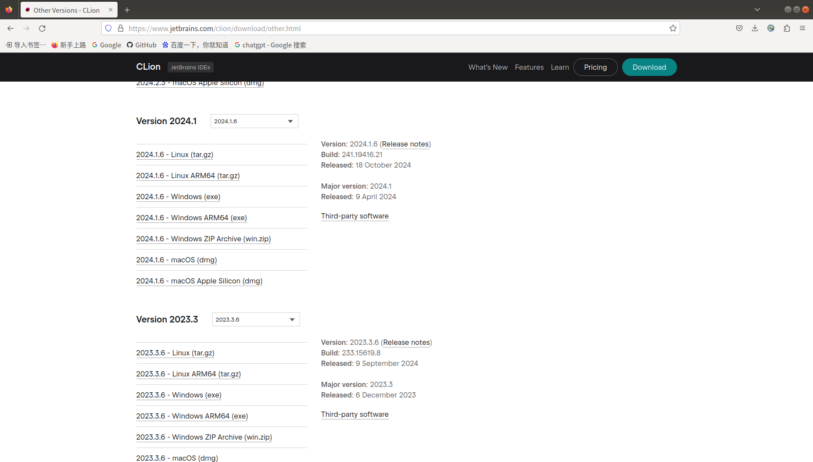
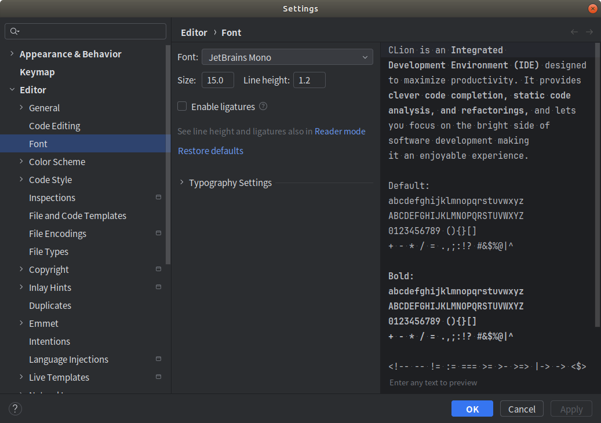

# Ubuntu Configuration


这份文档旨在为初学者提供一份从零开始重新安装和配置 Ubuntu 深度学习环境的参考 (同时也作为我自己的一个学习记录，方便以后在需要时不用再回忆或在重新网上查找资料  :joy: :joy: :joy: :joy: :joy:)

`第一级不缩进, 第二级缩进两个空格, 第三级缩进四个空格, 图片代码等比文字多缩进两个空格`


## 1. 重装 Ubuntu18.04 系统

- 参考链接: https://zhuanlan.zhihu.com/p/667673008

- Ubuntu18.04 系统镜像文件下载链接: https://releases.ubuntu.com/18.04/

- 点击如图所示的文件即可进行下载

  

- 由于我的电脑只有一个 256GB 的固态硬盘, 另外一块硬盘是 4TB 的机械硬盘, 因此将 Ubuntu 系统装在固态硬盘中

- 在分配 `根目录` 时, 参考链接里作者用的是 512GB 的硬盘, 所以作者分配了 160GB, 且分配了大概 300GB 给了 `/home` 目录; 而对于我自己的电脑来说, 只需要分配 64GB 给 `根目录`, 将多余的 160GB 分配给 `/home` 目录

- **Note:** 参考上面的链接进行重装时, 注意不要按照链接的方式分配 `tmp` 空间, 否则在安装一些软件的时候会提示 `tmp` 空间不足(我在安装 Nvidia 显卡驱动时遇到了), 可以跳过这一步, 让 `tmp` 直接分配到根目录即可(也许分配大一点可以解决? 但至于具体分配多少不会出问题，我没有进行测试)

- **Note:** 此外, 我还遇到了 Nvidia 显卡与 Ubuntu 内核不兼容的问题, 我的显卡是 RTX 2070Super, 根据链接的教程可以进行安装, 但是重启后会花屏, 且无法进入系统, 解决办法如下:

  - 参考链接: https://www.cnblogs.com/booturbo/p/13967033.html


## 2. 挂载硬盘

- 参考链接 1: https://blog.csdn.net/u011895157/article/details/130559749

- 参考链接 2: https://blog.csdn.net/qq_36357820/article/details/78421242

- 获取硬盘的 uuid

  ```
  ls -l /dev/disk/by-uuid
  ```

  

- 复制硬盘的 uuid，然后修改 fstab 文件

  ```
  sudo gedit /etc/fstab 
  ```

- 在文件最后添加如下图所示内容

  

  - 参数说明:

    - 第一列: 实际分区名, 卷标( Lable )或 UUID

      - SATA磁盘示例: /dev/hda1, /dev/hda2
      - SCSI磁盘示例：/dev/sda, /dev/sdb。
      - 使用标签时示例: LABEL=/
  
    - 第二列: 挂载点

      - 必须是已存在的目录, 建议挂载目录权限设置为 777，以便兼容
  
    - 第三列: 文件系统类型
  
      - 常见类型: ext2, ext3 等
      - 使用 auto 时, 系统自动检测文件系统类型, 通常用于可移动设备
  
    - 第四列: 挂载选项
  
      - auto: 系统自动挂载
      - defaults: 默认挂载选项( rw, suid, dev, exec, auto, nouser, async)
      - noauto: 不自动挂载
      - ro: 只读挂载
      - rw: 可读可写挂载
      - nouser: 只有超级用户可以挂载
      - user: 任何用户可以挂载
      - **Note:** 光驱和软驱需装有介质才能挂载，通常为 noauto。
  
    - 第五列: dump 备份设置
  
      - 1: 允许 dump 备份
      - 0: 不进行备份
      
    - 第六列: fsck 磁盘检查顺序
  
      - 0: 不检查
      - 1: 根分区
      - 2: 其他分区, 数字越小, 越先检查, 如果两个分区相同, 系统会同时检查

- 重启系统

  ```
  sudo reboot
  ```

- 设置硬盘权限

  - 查询磁盘挂载点当前权限

    ```
    ls -ld /home/zourz/work
    ```

  - 更改磁盘所属用户
 
    ```
    sudo chown zourz:zourz ~/work/
    ```

    
  

## 3. 安装百度网盘

- 参考链接: https://blog.csdn.net/suiqianjushi/article/details/123824801

- 下载 Linux 版本的 `deb 格式`

  

- **夸克网盘不支持 Linux 系统!!**


## 4. 使用 Clash 科学上网

- 安装 Clash for Windows 客户端

  - 下载链接: https://github.com/lantongxue/clash_for_windows_pkg/releases

    - **如果点击没反应, 应该是网络问题, 最好连接手机热点进行下载!!!**

  - 下载 Clash.for.Windows-0.20.39-x64-linux.tar.gz  

    

  - 解压缩

    ```
    tar -zxvf Clash.for.Windows-0.20.39-x64-linux.tar.gz -C ~/work/ProgramFiles/
    ```

  - 启动客户端, 在 Clash 文件夹目录打开终端, 输入

    ```
    ./cfw
    ```

    

- 导入节点并设置代理

  - **Note:** 可以选择其他的方式获取 Clash 订阅的链接, 这里分享的是我使用的 CuteCloud

  - CuteCloud 官网链接: https://dh.cutecloud.link/

  - 进入后注册登录(最好使用手机热点), 然后购买套餐后便可在主页一键复制 Clash 订阅

    

  - 回到 Clash 客户端, 点击 `Profiles`, 复制订阅链接到输入框中, 点击 `Download` 下载节点

    

  - 注意这里的端口号是 `7890`

    

  - 然后在 Firefox 浏览器上设置代理

    

  - 确定后便大功告成! Enjoy!

    


## 5. 安装 Git, gcc 和 CMake

  ```
  sudo apt update
  sudo apt-get install git
  sudo apt-get install build-essential 
  sudo apt-get install cmake
  ```


## 6. 安装 Anaconda

- 参考链接: https://blog.csdn.net/qq_64671439/article/details/135293643

- 现在下载需要提供邮箱

  

- 下载 x86 版本

  

  - 可以通过在终端输入 `uname -m` 来查询自己电脑的架构
 
    

- 然后根据参考链接进行安装即可

- 安装完成后需要给 Anaconda 进行换源

  ```
  conda config --add channels https://mirrors.ustc.edu.cn/anaconda/pkgs/free/
  conda config --add channels https://mirrors.ustc.edu.cn/anaconda/pkgs/main/
  conda config --add channels https://mirrors.ustc.edu.cn/anaconda/cloud/conda-forge/
  conda config --add channels https://mirrors.ustc.edu.cn/anaconda/cloud/pytorch/
  conda config --set show_channel_urls yes
  ```


## 7. 安装 CLion

- CLion 是用于 C++ 代码的编写

- 参考链接: https://blog.csdn.net/xiaowenshen/article/details/118761466

- 如果没有按照参考链接的方法生成桌面快捷方式, 可以按如下方式生成:

  - Tools --> Create Command-line Launcher (Desktop Shortcut)
 
- 学生认证:

  - 参考链接: https://blog.csdn.net/weixin_74009895/article/details/140642484
 
  - 如果不是学生的话, 也可以选择去淘宝购买激活码
 
  - 点击 Help -> Register 进行登录激活
 
- **Note:** 如果下载最新版的 CLion(如 2024.3 ), 会由于 `GLIBC` 版本太低而报错, 比如 CLion 2024.3 版本需要 `GLIBC 2.28`, 而 Ubuntu 18.04 默认使用的是 `GLIBC 2.27`, 因此需要下载旧版本的 CLion, 亲测 **CLion 2024.1** 版本的可以用(也可以升级 `GLIBC`)

   

- 设置字体

  - CLion 默认的字体很小, 可以在设置中自定义字体, 打开 File -> Settings -> Editor -> Font -> Size 即可调整字体大小
 
    


## 8. 安装 Pycharm 专业版

- Pycharm 是用于 Python 代码的编写

- 参考链接: https://blog.csdn.net/weixin_39450145/article/details/130022227

- **Note:** 为了避免安装报错, 选择安装 **Pycharm 专业版 2024.1**

- 如果没有按照参考链接的方法生成桌面快捷方式, 可以按如下方式生成:

  - Tools --> Desktop Entry (Taskbar Shortcut)

- 学生认证的方式跟 CLion 是一样的, 认证后登录账号即可激活


## 9. 安装英伟达显卡驱动

- 参考链接: https://blog.csdn.net/coolsmartboy/article/details/120532547

  


## 10. 安装 CUDA 11.3 和 CUDNN 8.2.1

- 参考链接: https://blog.csdn.net/BIT_HXZ/article/details/127604530

- ### 10.1 安装 CUDA 11.3

  - Nvidia 官网的 CUDA 版本列表: https://developer.nvidia.com/cuda-toolkit-archive
 
  - 进入 11.3 版本的页面, 按如图所示进行选择:
 
    
  
  - 运行下载命令进行下载
 
    ```
    wget https://developer.download.nvidia.com/compute/cuda/11.3.0/local_installers/cuda_11.3.0_465.19.01_linux.run
    ```

  - 到下载目录运行安装命令

    ```
    sudo sh cuda_11.3.0_465.19.01_linux.run
    ```

  - 在安装过程中, 按如图所示进行选择
 
    

    

    
  
  - 将 CUDA 配置到环境变量
 
    - 终端输入:
 
      ```
      gedit ~/.bashrc
      ```

    - 在文件末尾添加以下语句:
   
      ```
      export CUDA_HOME=$CUDA_HOME:/usr/local/cuda-11.3
      export PATH=/usr/local/cuda-11.3/bin:$PATH
      export LD_LIBRARY_PATH=/usr/local/cuda-11.3/lib64:$LD_LIBRARY_PATH
      ```
    
    -  使更改的环境配置生效

      ```
      source ~/.bashrc
      ```

  - 测试 CUDA
 
    - 在终端输入以下语句:
   
      ```
      cd /usr/local/cuda/samples/1_Utilities/deviceQuery #由自己电脑目录决定
      sudo make
      sudo ./deviceQuery
      ```

      
 
  
- ### 10.2 安装 CUDNN 8.2.1 

  - 官网下载链接: https://developer.nvidia.com/rdp/cudnn-archive

  - **Note:** 需要登录 Nvidia 账号
 
  - 选择 `Download cuDNN v8.2.1 (June 7th, 2021), for CUDA 11.x`
 
  - 然后选择 `cuDNN Library for Linux (x86_64)`, 点击即可下载
 
  - 进入下载的目录, 终端输入:

    ```
    tar -xvf cudnn-11.3-linux-x64-v8.2.1.32.tgz -C ~/work/ProgramFiles/
    ```
    
  - 进入解压后的文件夹内, 终端输入:

    ```
    sudo cp include/* -R /usr/local/cuda/include/
    sudo cp lib64/libcudnn* /usr/local/cuda/lib64/
    sudo chmod a+r /usr/local/cuda/include/cudnn.h 
    sudo chmod a+r /usr/local/cuda/lib64/libcudnn*
    ```

  - 测试 CUDNN

    - 在终端输入:

      ```
      cat /usr/local/cuda/include/cudnn_version.h | grep CUDNN_MAJOR -A 2
      ```

      


## 11. 安装 Libtorch

- Pytorch 官网只提供最新版本的 Libtorch, 可以点击以下链接下载 Libtorch 以往版本

  - 下载链接: https://blog.csdn.net/weixin_43742643/article/details/114156298

- 这里我下载的是 1.8.1 版本的 Libtorch, 选择如图所示的链接进行下载

  

  - **Note:** 提供的下载链接里, 所有版本的 Libtorch 都是已经编译好的, 解压后就可以使用

- 解压后的文件夹改名成 `libtorch-1.8.1-cu113` (不然太长了...), 然后放在你想保存的位置

- 测试 Libtorch 和 CUDA 是否可以调用

  - 编写 libtorch_test.cpp 文件

    ```c++
    #include <iostream>
    #include <torch/torch.h>
    #include <torch/script.h>
    
    int main() {
        std::cout << "检查CDUA是否可用：" << torch::cuda::is_available() << std::endl;
        std::cout << "检查cudnn是否可用：" << torch::cuda::cudnn_is_available() << std::endl;
        std::clock_t s, e;
        s = clock();
        torch::Tensor cuda_output;
        for (int i=0;i<1;i++) {
            cuda_output = torch::randn({ 5, 4 }, torch::device(torch::kCUDA));
        }
        std::cout << cuda_output << std::endl;
        e = clock();
        std::cout << "use time: " << (e - s) << " 微秒" << std::endl;
        return 0;
    }
    
    ```

  - 配置 CMakeLists.txt 文件

    ```cmake
    cmake_minimum_required(VERSION 3.0 FATAL_ERROR)
    project(libtorch_test)
    
    set(CMAKE_CXX_STANDARD 17)
    
    list(APPEND CMAKE_PREFIX_PATH "/home/zourz/Thirdparty/libtorch-1.8.1-cu113")
    
    add_executable(libtorch_test libtorch_test.cpp)
    
    find_package(Torch REQUIRED)
    target_link_libraries(libtorch_test "${TORCH_LIBRARIES}")
    
    ```

  - 测试运行
 
    - 在终端依次输入
   
      ```
      mkdir build
      cd build/
      cmake ..
      make -j8  # 根据自己电脑的 CPU 核心数进行更改, 我的是 i7 10700K
      ```

    - 编译好后在终端输入:
   
      ```
      ./libtorch_test
      ```

    - 打印出 CUDAFloatype{5,4}, 那么意味着这个张量是在显存中分配的
    
      


## 12. 将 Anaconda 中的虚拟环境迁移到机械硬盘

- 之前将 Anaconda 安装到了固态盘, 随着学习时间的的增加, 创建的虚拟环境越来越多, 导致固态盘的空间吃紧
     
- 因此需要将 Anaconda 的虚拟环境目录改到机械硬盘上, 以后每次安装虚拟环境也是直接装在机械盘

- 按照之前的配置流程, 我这台主机的机械硬盘挂载点是 `/home/zourz/work`, "Ctrl + Alt + T " 打开终端, 依次输入:

  ```
  df -h ~/work
  mkdir -p ~/work/envs
  ```

  - 这里的-p即--parents的缩写, 如果路径中的父目录不存在, 则自动创建, 不报错

  
 
- 编辑 Conda 配置, 让后续安装的新环境自动安装在所选的目录, 在终端输入:
 
  ```
  nano ~/.condarc
  ```

- 在文件中添加如下内容(**注:** 必须写绝对路径), "Ctrl + O"(写出), 然后底部会显示文件名，直接按 "Enter" 确认保存(或输入新文件名), 再"Ctrl + X"(退出)
 
  ```
  envs_dirs:
    - /home/zourz/work/envs
    - /home/zourz/anaconda3/envs
  ```
  
 
 - 验证修改是否生效, 在终端输入:
 
  ```
  conda info
  ```

  


 
      
      
